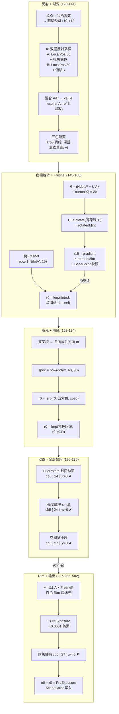
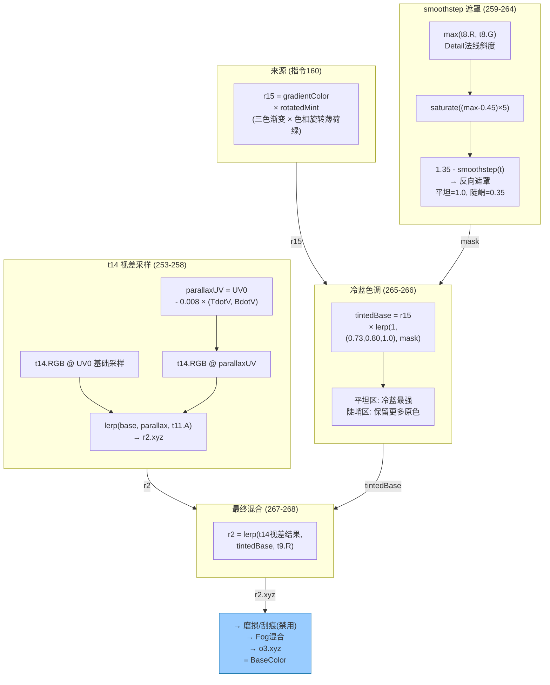

<br>

这是商店皮肤的效果：  
  


记录一次ai辅助逆向的流程，第一部分是shader的内容，第二部分是ai辅助过程  
比起几个月前的逆向尝试，只能说ai进步太快了  
能够规划出一个工作流，shader的理解基本上没有问题，可能再过段时间，可以放心的交给ai直接生成材质了  

--- 
<details markdown="1">
  <summary>展开查看 shader逆向</summary>

### Emissive输出

<details markdown="1">
  <summary>Emissive整体流程</summary>


</details>

<br>

逐个部分分析：  

---

  
这是整个效果比较核心的部分  
局部空间坐标，两种缩放，分别采样下图  
采样的坐标做随视线变化（viewdir分别在tangent和bitangent的投影）的偏移  
两次采样的结果在用下图模型uv采样的结果做混合  
  

<details markdown="1">
  <summary>双层反射贴图采样shader</summary>

```hlsl
// ============================================================================
// [指令 120-135] 双层反射贴图采样 (t8 复用) + 视角相关渐变查找
//
// === 进入此段时的关键寄存器状态 ===
//   r0.xyz  = Bitangent (指令0-2计算, 未被覆盖)
//   r2.xyz  = ViewDir = normalize(-translatedWorldPos) (指令15)
//   r5.x    = LocalPos.Y (指令23, =v2.w)
//   r5.y    = LocalPos.Z (指令24, =v3.x)
//   r5.z    = t9.R (红通道, 区域遮罩, 指令38: swizzle .zwxy + mask .zw → z←R, w←G)
//   r5.w    = t9.G (绿通道, 紫色强度遮罩, 指令38)
//   r6.z    = t8.B @LocalPos.YZ/18 (Detail贴图B通道粗采样, 指令26, 后续用作空间变化权重)
//   r8.xyz  = 世界空间法线 (指令119, 已归一化)
//   v0.xyz  = Tangent (世界空间, 来自VS)
//
// === 设计思路 ===
//   t8 被采样3次, 不同UV/不同通道, 构成 "空间变化 + 视角偏移" 的反射色:
//     1. 指令26 粗采样 (LocalPos.YZ/18): r6.z=B通道 → 空间变化权重
//     2. 指令128 细采样A (LocalPos.YZ/50 + viewOffset_A): 取B通道
//     3. 指令133 细采样B (LocalPos.YZ/8 + viewOffset_B): 取R通道
//   r6.z 同时控制: (a) 视角偏移量的缩放, (b) 两次细采样的最终混合比
//   → 产生随物体位置 + 观察角度变化的反射纹理值, 用于驱动三色渐变
//
// === CB参数 ===
//   cb5[2]  = (0.70, 0, 1.0) 紫色基调乘数
//   cb5[22] = (1, 0, 3, 50)  .z=暗色叠加强度  .w=反射UV_A缩放(50)
//   cb5[23] = (1.5, 8, -2, 15)  .x=偏移A  .y=反射UV_B缩放(8)  .z=偏移B  .w=Fresnel指数
// ============================================================================

// --- 步骤1: 暗色叠加基底 (r10, r12 供后续指令193使用) ---
 120: mul r10.xyz, r5.wwww, cb5[2].xyzx
      // r10.xyz = t9.G × (0.70, 0, 1.0)
      //         = t9.G × 紫色乘数
      // r5.w = t9.G (绿通道, 指令38), 控制紫色覆盖强度
 121: mul r12.xyz, r10.xyzx, cb5[22].zzzz
      // r12.xyz = r10 × 3 = t9.G × (2.1, 0, 3.0)
      // 暗色叠加基底: 紫色 × 强度3 → 后续在指令193中从颜色中减去

// --- 步骤2: 反射采样A (粗尺度 LocalPos.YZ/50 + 视角偏移) ---
 122: div r9.zw, r5.xxxy, cb5[22].wwww
      // r9.z = LocalPos.Y / 50
      // r9.w = LocalPos.Z / 50
      // 反射UV_A 基础坐标: 物体空间, 每50单位重复一次 (大尺度图案)
 123: mul r13.xy, cb5[23].xzxx, l(-0.500000, -0.500000, 0.000000, 0.000000)
      // r13.x = 1.5 * -0.5 = -0.75   (偏移A的中心)
      // r13.y = (-2) * -0.5 = 1.0     (偏移B的中心)
      // 这两个中心值使得 r6.z=0.5 时偏移为0, 偏移在[-center, +center]范围对称
 124: mad r3.w, cb5[23].x, r6.z, r13.x
      // r3.w = 1.5 * r6.z - 0.75
      //   r6.z=0   → r3.w = -0.75   (反向视角偏移)
      //   r6.z=0.5 → r3.w = 0       (无偏移)
      //   r6.z=1   → r3.w = 0.75    (正向视角偏移)
      // r6.z (t8.B @LocalPos.YZ/18) 决定每个表面点的视角偏移强度和方向
 125: dp3 r14.x, v0.xyzx, r2.xyzx
      // r14.x = dot(Tangent, ViewDir) = TdotV
      // 视线在切平面上的U方向投影
 126: dp3 r14.y, r0.xyzx, r2.xyzx
      // r14.y = dot(Bitangent, ViewDir) = BdotV
      // 视线在切平面上的V方向投影
      // ⚠ 这里 r0.xyz 仍是指令0-2计算的 Bitangent, 下一条指令将覆盖 r0.xy
 127: mad r0.xy, r14.xyxx, r3.wwww, r9.zwzz
      // r0.x = TdotV * (1.5*r6.z - 0.75) + LocalPos.Y/50
      // r0.y = BdotV * (1.5*r6.z - 0.75) + LocalPos.Z/50
      // UV_A = 物体空间基底 + 视角切平面偏移 × 空间变化缩放
      // ⚠ r0.xy 被覆盖, Bitangent.xy 丢失 (后续不再需要)
 128: sample_b(texture2d)(float,float,float,float) r0.x, r0.xyxx, t8.zxyw, s5, cb1[154].z
      // r0.x = t8.Sample(s5, UV_A, mipBias=-0.3)
      // 资源 swizzle .zxyw → 输出顺序 (B,R,G,A), 目标 .x → 取第一项 = B通道
      // 即: sampleA = t8.Blue @ UV_A

// --- 步骤3: 反射采样B (细尺度 LocalPos.YZ/8 + 视角偏移) ---
 129: div r0.yz, r5.xxyx, cb5[23].yyyy
      // r0.y = LocalPos.Y / 8
      // r0.z = LocalPos.Z / 8
      // 反射UV_B 基础坐标: 每8单位重复 (较细尺度, 更多细节)
      // ⚠ r0.z 被覆盖, Bitangent.z 也丢失
 130: add r3.w, -r6.z, l(1.000000)
      // r3.w = 1 - r6.z
 131: mad r3.w, cb5[23].z, r3.w, r13.y
      // r3.w = (-2) * (1 - r6.z) + 1.0
      //      = -2 + 2*r6.z + 1
      //      = 2*r6.z - 1
      //   r6.z=0   → r3.w = -1  (强反向偏移)
      //   r6.z=0.5 → r3.w = 0   (无偏移)
      //   r6.z=1   → r3.w = 1   (强正向偏移)
      // 偏移B 的范围 [-1,+1] 大于偏移A 的 [-0.75,+0.75]
 132: mad r0.yz, r14.xxyx, r3.wwww, r0.yyzy
      // r0.y = TdotV * (2*r6.z - 1) + LocalPos.Y/8
      // r0.z = BdotV * (2*r6.z - 1) + LocalPos.Z/8
      // UV_B = 物体空间基底 + 视角偏移 × 空间变化缩放
 133: sample_b(texture2d)(float,float,float,float) r0.y, r0.yzyy, t8.xzyw, s5, cb1[154].z
      // r0.y = t8.Sample(s5, UV_B, mipBias=-0.3)
      // 资源 swizzle .xzyw → 输出顺序 (R,B,G,A), 目标 .y → 取第一项 = R通道
      // 即: sampleB = t8.Red @ UV_B
      // 注意: 采样A取B通道, 采样B取R通道 → t8的R和B通道存储了两套不同的渐变图案

// --- 步骤4: 混合两次采样 ---
 134: add r0.y, -r0.x, r0.y
      // r0.y = sampleB_R - sampleA_B
 135: mad r0.x, r6.z, r0.y, r0.x
      // r0.x = sampleA_B + r6.z * (sampleB_R - sampleA_B)
      //      = lerp(sampleA_B, sampleB_R, r6.z)
      // r6.z 同时控制偏移方向和混合比例:
      //   r6.z≈0: 主要使用 t8.B @粗UV (大尺度), 视角偏移反向
      //   r6.z≈1: 主要使用 t8.R @细UV (细尺度), 视角偏移正向
      //   r6.z≈0.5: 等权混合, 视角偏移≈0 → 静态中性色
      //
      // === 此时 r0.x = 最终混合值 value ∈ [0,1], 用于驱动下方三色渐变 ===
```
</details>

--- 
  
在有了上一步随视线变化的灰度值，接着通过灰度值在三个颜色之间插值，得到三色渐变  
<details markdown="1">
  <summary>三色渐变查找shader</summary>

```hlsl
// ============================================================================
// [指令 136-144] 三色渐变查找: 根据 value 在三个颜色之间插值
//
// === 渐变色定义 ===
//   cb5[6] = 色A = 青绿  (0.35, 0.77, 0.82)   ← value=0
//   cb5[5] = 色B = 深蓝  (0.11, 0.22, 0.48)   ← value=0.5
//   cb5[8] = 色C = 薰衣草紫 (0.63, 0.54, 0.73) ← value=1
//
// === 数学推导 ===
//   令 v = r0.x (value)
//
//   t_front = saturate(2v)          -- 前半段alpha: v∈[0,0.5] → [0,1]
//   t_back  = saturate(2v - 1)      -- 后半段alpha: v∈[0.5,1] → [0,1]
//   r13 = lerp(色A, 色B, t_front)   -- 前半段: 青绿 → 深蓝
//   r15 = lerp(色B, 色C, t_back)    -- 后半段: 深蓝 → 薰衣草紫
//   result = r13 + v * (r15 - r13)  -- 用原始v在两段结果间插值
//
//   展开后:
//     v∈[0, 0.5]: result = 色A + (3v - 2v²)(色B - 色A)    -- 二次曲线, 非线性
//     v∈[0.5, 1]: result = 色B + (2v² - v)(色C - 色B)     -- 二次曲线, 非线性
//
//   关键验证:
//     v=0   → result = 色A (青绿)     ✓
//     v=0.5 → result = 色B (深蓝)     ✓
//     v=1   → result = 色C (薰衣草紫)  ✓
//
//   注意: 由于最后用原始v做最终插值, 两段间的过渡是二次曲线而非线性,
//         在 v=0 和 v=1 附近变化更快, v=0.5 附近变化较平缓
// ============================================================================

// --- 前半段: 青绿(色A) → 深蓝(色B), v∈[0, 0.5] ---
 136: add_sat r0.y, r0.x, r0.x
      // r0.y = saturate(2 * value)
      //   value=0   → r0.y=0    (全青绿)
      //   value=0.25 → r0.y=0.5  (青绿/深蓝各半)
      //   value≥0.5 → r0.y=1    (全深蓝, 被clamp)
 137: add r13.xyz, cb5[5].xyzx, -cb5[6].xyzx
      // r13 = cb5[5] - cb5[6]
      //      = (0.11-0.35, 0.22-0.77, 0.48-0.82)
      //      = (-0.24, -0.55, -0.34)
 138: mad r13.xyz, r0.yyyy, r13.xyzx, cb5[6].xyzx
      // r13 = cb5[6] + r0.y * (cb5[5] - cb5[6])
      //      = lerp(青绿, 深蓝, saturate(2v))
      //   value=0:   (0.35, 0.77, 0.82) = 青绿
      //   value=0.5: (0.11, 0.22, 0.48) = 深蓝
      //   value>0.5: (0.11, 0.22, 0.48) = 深蓝 (已clamp)

// --- 后半段: 深蓝(色B) → 薰衣草紫(色C), v∈[0.5, 1] ---
 139: add r0.y, r0.x, l(-0.500000)
      // r0.y = value - 0.5
 140: add_sat r0.y, r0.y, r0.y
      // r0.y = saturate(2 * (value - 0.5))
      //   value≤0.5 → r0.y=0    (全深蓝, 被clamp)
      //   value=0.75 → r0.y=0.5  (深蓝/薰衣草各半)
      //   value=1   → r0.y=1    (全薰衣草紫)
 141: add r15.xyz, -cb5[5].xyzx, cb5[8].xyzx
      // r15 = cb5[8] - cb5[5]
      //      = (0.63-0.11, 0.54-0.22, 0.73-0.48)
      //      = (0.52, 0.32, 0.25)
 142: mad r15.xyz, r0.yyyy, r15.xyzx, cb5[5].xyzx
      // r15 = cb5[5] + r0.y * (cb5[8] - cb5[5])
      //      = lerp(深蓝, 薰衣草紫, saturate(2v-1))
      //   value<0.5: (0.11, 0.22, 0.48) = 深蓝
      //   value=0.5: (0.11, 0.22, 0.48) = 深蓝
      //   value=1:   (0.63, 0.54, 0.73) = 薰衣草紫

// --- 最终合成: 用原始 value 在两段结果间插值 ---
 143: add r15.xyz, -r13.xyzx, r15.xyzx
      // r15 = r15 - r13 (后半段结果 - 前半段结果)
 144: mad r0.xyz, r0.xxxx, r15.xyzx, r13.xyzx
      // r0.xyz = r13 + value * (r15 - r13)
      //
      // 等价伪代码:
      //   float3 frontColor = lerp(青绿, 深蓝, saturate(2*v));
      //   float3 backColor  = lerp(深蓝, 薰衣草紫, saturate(2*v - 1));
      //   float3 result     = frontColor + v * (backColor - frontColor);
      //
      // 验证本帧关键点:
      //   v=0   → front=青绿(0.35,0.77,0.82), back=深蓝(0.11,0.22,0.48)
      //           result = 青绿 + 0*(深蓝-青绿) = (0.35, 0.77, 0.82) ✓
      //   v=0.5 → front=深蓝(0.11,0.22,0.48), back=深蓝(0.11,0.22,0.48)
      //           result = 深蓝 + 0.5*0 = (0.11, 0.22, 0.48) ✓
      //   v=1   → front=深蓝(0.11,0.22,0.48), back=薰衣草(0.63,0.54,0.73)
      //           result = 深蓝 + 1*(薰衣草-深蓝) = (0.63, 0.54, 0.73) ✓
      //
      // === 此时 r0.xyz = 三色渐变结果, 存储为当前颜色, 后续进入色相旋转+Fresnel ===
```
</details>

--- 
  
  
在原有色彩变化基础上，给一个转折面内部增加了更多的颜色变化细节  
这一步是基于NdotV数值，uv0.x，切线空间法线的x方向共同计算出色相旋转  
<details markdown="1">
  <summary>色相旋转和菲涅尔shader</summary>

```hlsl
// ============================================================================
// [指令 145-168] 色相旋转 + Fresnel 边缘发光
//
// === 进入此段时的关键寄存器状态 ===
//   r0.xyz  = 三色渐变结果 (青绿→深蓝→薰衣草, 指令144)  → 最终写入 o0 (Emissive/SceneColor)
//   r2.xyz  = ViewDir (世界空间, 指令15, 未被覆盖)
//   r7.xyz  = RNM混合中间值 (切线空间, 未归一化, 指令37, 到指令173前未被覆盖)
//             = mainNormal*(dot) - (mainZ+1)*flippedDetail
//             ≈ 与主法线切线空间方向成正比, 非"detailNormal"
//   r8.xyz  = 世界空间法线 (指令119, 归一化)
//   v2.x    = UV.x
//
// === 两个子过程 ===
//   A. 色相旋转 (145-160): 对 cb5[10] 薄荷绿做 Rodrigues 旋转, 旋转角随位置变化,
//      旋转后与渐变色逐分量相乘 → "tinted" 调制色 (存入 r15, 同时供 BaseColor 路径使用)
//   B. Fresnel边缘发光 (161-168): 用伪Fresnel在 tinted 和 深海蓝 间插值
//      → 正面保持 tinted, 边缘趋向深海蓝
//
// === CB参数 ===
//   cb5[10]  = (0.69, 1.0, 0.80) 薄荷绿 (色相旋转基色)
//   cb5[12]  = (0.14, 0.18, 0.33) 深海蓝 (边缘发光色)
//   cb5[23].w = 15 (Fresnel 指数)
// ============================================================================

// ─────────── A. 色相旋转 (Rodrigues Rotation) ───────────

// --- A1. 计算旋转角度 θ (空间变化, 每像素不同) ---
 145: dp3 r3.w, r8.xyzx, r2.xyzx
 146: max r3.w, r3.w, l(0)
      // r3.w = max(dot(worldNormal, ViewDir), 0) = NdotV
      // 用世界法线和视线方向的真实 NdotV (后续 Rim 光也复用此值)
 147: mul r4.w, r3.w, r3.w
      // r4.w = NdotV²
 148: mad_sat r4.w, r4.w, l(21.000000), l(-10.000000)
      // r4.w = saturate(NdotV² * 21 - 10)
      //   NdotV < 0.69 → r4.w = 0   (边缘/倾斜面)
      //   NdotV = 0.80 → r4.w = saturate(0.80²*21 - 10) = sat(3.44) = 1
      //   只有正对摄像机的面才会 >0, 产生旋转角度偏移
 149: add r5.x, r7.x, v2.x
      // r5.x = r7.x + UV.x
      // ⚠ r7.x = RNM混合中间值的X分量 (切线空间, ≈主法线X方向的扰动)
      //   不是 detailNormal.x! r7 自指令37后未被覆盖
      //   r7.x 随法线贴图变化, UV.x 沿表面线性变化 → 两者叠加提供空间变化
 150: add r4.w, r4.w, r5.x
      // r4.w = NdotV正对区域偏移 + 法线扰动 + UV.x
 151: mul r4.w, r4.w, l(6.283185)
      // θ = r4.w * 2π
      // 旋转角度随像素位置 (UV.x) 和法线细节 (r7.x) 连续变化
      // → 色相在枪械表面形成连续渐变的彩虹条纹效果

// --- A2. HueRotate(cb5[10], θ) — 对薄荷绿做空间变化的色相旋转 ---
//   (⇒ 通用函数 HueRotate 的实例1, 定义见文件头部)

 152: dp3 r5.x, l(0.577350, 0.577350, 0.577350, 0.000000), cb5[10].xyzx
      // r5.x = dot(k, cb5[10]) = dot((1,1,1)/√3, (0.69, 1.0, 0.80))
      //       = 0.5774 × (0.69 + 1.0 + 0.80) = 0.5774 × 2.49 = 1.438
      // 这是 cb5[10] 在灰度轴上的投影长度 (亮度分量)
 153: mad r13.xyz, -r5.xxxx, l(0.577350, 0.577350, 0.577350, 0.000000), cb5[10].xyzx
      // r13 = cb5[10] - r5.x × k
      //      = (0.69, 1.0, 0.80) - 1.438 × (0.577, 0.577, 0.577)
      //      = (0.69, 1.0, 0.80) - (0.830, 0.830, 0.830)
      //      = (-0.140, 0.170, -0.030)
      // 色度分量 v = 薄荷绿减去灰度 → 纯色彩信息, 满足 k·v = 0

 154: mul r15.xyz, r13.zxyz, l(0.577350, 0.577350, 0.577350, 0.000000)
      // r15 = r13.zxy × 0.577 = (-0.030, -0.140, 0.170) × 0.577
      //      = (-0.0173, -0.0808, 0.0981)
 155: mad r15.xyz, r13.zxyz, l(0.577350, 0.577350, 0.577350, 0.000000), -r15.zxyz
      // r15.x = r13.z×0.577 - r15.z = 0.577×(r13.z - r13.y) = 0.577×(-0.030-0.170) = -0.1155
      // r15.y = r13.x×0.577 - r15.x = 0.577×(r13.x - r13.z) = 0.577×(-0.140+0.030) = -0.0635
      // r15.z = r13.y×0.577 - r15.y = 0.577×(r13.y - r13.x) = 0.577×(0.170+0.140) = +0.1789
      //
      // 即 r15 = cross(k, v) = k × chroma   (⚠ 是 cross(k, r13), 不是 cross(r13, k))
      // 验证: cross(k, v).x = k.y×v.z - k.z×v.y = 0.577×(-0.030) - 0.577×(0.170) = -0.1155 ✓

 156: sincos r16.x, r17.x, r4.w
      // r16.x = sin(θ)
      // r17.x = cos(θ)

 157: mul r15.xyz, r15.xyzx, r16.xxxx
      // r15 = (k × v) × sin(θ)

 158: mad r13.xyz, r13.xyzx, r17.xxxx, r15.xyzx
      // r13 = v × cos(θ) + (k × v) × sin(θ) = v_rot
      // Rodrigues 旋转完成 (因 k·v=0, 第三项消失)

 159: mad r13.xyz, r5.xxxx, l(0.577350, 0.577350, 0.577350, 0.000000), r13.xyzx
      // r13 = r5.x × k + v_rot
      //      = 灰度投影 + 旋转后色度
      //      = 重建完整颜色: 亮度不变, 色相旋转了 θ 角
      //
      // === r13.xyz = 色相旋转后的薄荷绿 (亮度=原始, 色相随位置变化) ===

// --- A3. 渐变色 × 旋转后薄荷绿 → 调制色 tinted ---
 160: mul r15.xyz, r0.xyzx, r13.xyzx
      // r15 = gradientColor × rotatedMint (逐分量乘法)
      // 三色渐变被旋转后的薄荷绿调制, 产生带薄荷绿色调的着色
      //
      // ⚠ 重要: r15 是 SceneColor 和 BaseColor 的分叉点!
      //   - r15 后续在指令265-266中用于构建 BaseColor (o3)
      //   - r0 继续被 Fresnel/高光等修改, 最终成为 Emissive/SceneColor (o0)

// ─────────── B. Fresnel 边缘发光 ───────────

// --- B1. 计算伪 Fresnel 项 ---
 161: dp3 r2.x, r7.xyzx, r2.xyzx
      // r2.x = dot(r7, ViewDir)
      // ⚠ 注意: r7 是切线空间的 RNM 中间值 (指令37), r2 是世界空间 ViewDir (指令15)
      //   这不是几何上严格的 NdotV, 而是一个混合空间的伪 Fresnel:
      //   r7 ≈ (mainZ+1) × (mainNormX, mainNormY, mainNormZ) (未归一化)
      //   dot 的大小受切线空间法线方向和世界空间视角的共同影响
      //   → 产生比纯世界法线 NdotV 更丰富的空间变化, 带有法线贴图细节
      // ⚠ r2.x 被覆盖后, r2.yz 仍保持 ViewDir.yz (但后续不再使用)
 162: max r2.x, r2.x, l(0)
      // r2.x = max(dot, 0)
 163: add r2.x, -r2.x, l(1.000000)
      // r2.x = 1 - max(dot, 0)  (Fresnel 基础项: 正面→0, 边缘→1)

 164: log r2.x, abs(r2.x)
 165: mul r2.x, r2.x, cb5[23].w
 166: exp r2.x, r2.x
      // r2.x = pow(|1 - dot|, 15)
      // cb5[23].w = 15 → 极高指数, 只在非常边缘才 >0
      // pow(0.9, 15) = 0.206, pow(0.8, 15) = 0.035, pow(0.5, 15) ≈ 0
      // → 极窄的边缘发光带, 只有几乎平行于视线的面才会亮

// --- B2. 在调制色与深海蓝之间做 Fresnel 插值 ---
 167: mad r0.xyz, -r0.xyzx, r13.xyzx, cb5[12].xyzx
      // r0 = cb5[12] - r0_old × r13
      //    = deepSeaBlue - gradient × rotatedMint
      //    = (0.14, 0.18, 0.33) - r15
      //    = edgeColor - tintedColor
 168: mad r0.xyz, r2.xxxx, r0.xyzx, r15.xyzx
      // r0 = fresnel × (deepSeaBlue - tinted) + tinted
      //    = tinted + fresnel × (deepSeaBlue - tinted)
      //    = lerp(tinted, deepSeaBlue, fresnel)
      //
      //   fresnel ≈ 0 (正面): r0 = tinted = 渐变×旋转薄荷绿 (丰富冷色调)
      //   fresnel ≈ 1 (边缘): r0 = deepSeaBlue = (0.14, 0.18, 0.33) (深海蓝辉光)
      //
      // === r0.xyz = Fresnel混合后的自发光颜色, 继续进入各向异性高光 (指令169) ===
```
</details>

--- 
  
添加了一个各向异性高光  
设置一个各向异性轴，这里接近于Z轴  
用视线方向点乘构建出的向量  

<details markdown="1">
  <summary>各向异性高光shader</summary>

```hlsl
// ============================================================================
// [指令 169-192] 各向异性高光 (双叉积构造)
//
// === 算法概述 ===
//   双叉积法构造各向异性高光方向:
//     1. D = normalize(cameraToPixel)        (视线方向, 从摄像机指向像素)
//     2. S = 各向异性轴                       (枪身纵向)
//     3. n = normalize(D × S)                 (垂直于 D 和 S 的方向)
//     4. m = normalize(n × S)                 (垂直于 S, 在 D-S 平面内)
//     5. anisoFactor = max(dot(m, N), 0)      (m 与法线的对齐度)
//     6. spec = pow(anisoFactor, 90)           (极窄高光带)
//   这是标准的 Kajiya-Kay 各向异性模型的变体 (纯视角驱动, 无独立光源方向)
//   → 效果: 沿 S 轴方向拉伸的金属光泽条纹, 像竖直拉丝金属
//
// === CB参数 ===
//   cb1[26]  = (-1, ~0, 0)       引擎参考方向 (近似-X轴)
//   cb5[15]  = (1, 1.5, 16)      材质各向异性轴参数
//   sum(世界空间) = (0, 1.5, 16) 几乎纯 Z(=UE5上方) → 竖直方向高光轴
//   cb5[16]  = (0.63, 0.39, 1.0) 蓝紫色高光颜色
//   cb1[75]  = (25322, 12202, 12000) = PreViewTranslation (≈摄像机位置)
//
// === DXBC 编译优化: YZX 置换技巧 ===
//   指令 169 和 173 都对源操作数应用 .yzx 重排 (swizzle),
//   使得第一次叉积的中间结果带有 YZX 循环置换。
//   但第二次叉积 (179-180) 使用了不同的 swizzle 模式,
//   恰好抵消了第一次的置换 → 最终结果 m 是正确的世界空间方向。
//   (已通过数值验证: D=(0.2,0.3,0.9), S=(0,1.5,16) 两种计算路径结果一致)
// ============================================================================

// --- 步骤1: 计算摄像机到像素方向 D ---
 169: add r2.xyz, r3.yzxy, -cb1[75].yzxy
      // r2 = r3.yzx - cb1[75].yzx
      //    = absoluteWorldPos.YZX - preViewTranslation.YZX
      //    = translatedWorldPos.YZX
      // translatedWorldPos = absoluteWorldPos - cameraPos ≈ 摄像机到像素的向量
      // .yzx 置换是 DXBC 编译器优化, 后续第二次叉积会抵消
 170: dp3 r4.w, r2.xyzx, r2.xyzx
 171: sqrt r4.w, r4.w
 172: div r2.xyz, r2.xyzx, r4.wwww
      // r2 = normalize(translatedWorldPos.YZX)
      // = normalize(cameraToPixelDir).YZX
      // 即 D_perm = D_world.YZX (中间结果, 带 YZX 置换)

// --- 步骤2: 构造各向异性轴 S ---
 173: add r7.xyz, cb1[26].yzxy, cb5[15].yzxy
      // r7 = cb1[26].yzx + cb5[15].yzx
      //    = (~0, 0, -1) + (1.5, 16, 1)
      //    = (1.5, 16, 0) = S_perm
      //
      // 原始世界空间: cb1[26] + cb5[15] = (-1+1, 0+1.5, 0+16) = (0, 1.5, 16)
      //   Z=16 远大于 Y=1.5 → 几乎纯竖直 (UE5 Z=上)
      //   .yzx 后: (1.5, 16, 0), 与 D_perm 在同一置换空间中

// --- 步骤3: 第一次叉积 — T = normalize(D_perm × S_perm) ---
 174: mul r13.xyz, r2.xyzx, r7.zxyz
      // r13 = D_perm.xyz × S_perm.zxy (逐分量)
      //      = (D.x*S.z, D.y*S.x, D.z*S.y)
 175: mad r2.xyz, r2.zxyz, r7.xyzx, -r13.xyzx
      // r2 = D_perm.zxy × S_perm.xyz - r13
      // 展开 = (D.z*S.x - D.x*S.z, D.x*S.y - D.y*S.x, D.y*S.z - D.z*S.y)
      // = cross(D_perm, S_perm) 的 YZX 重排
      //   (标准 DXBC 叉积编译模式, 结果循环偏移一个分量)
 176: dp3 r4.w, r2.xyzx, r2.xyzx
 177: sqrt r4.w, r4.w
 178: div r2.xyz, r2.xyzx, r4.wwww
      // r2 = T = normalize(cross(D_perm, S_perm).yzx)
      // 等价于 normalize(cross(D_world, S_world)).ZXY (双重置换: 原始→YZX→再YZX=ZXY)

// --- 步骤4: 第二次叉积 — m = normalize(T × S) 在世界空间 ---
 179: mul r13.xyz, r7.xyzx, r2.xyzx
      // r13 = S_perm ⊙ T (逐分量乘法, 注意: 不同于第一次叉积的 swizzle!)
      //      = (S.x*T.x, S.y*T.y, S.z*T.z)
 180: mad r2.xyz, r2.zxyz, r7.yzxy, -r13.xyzx
      // r2 = T.zxy × S_perm.yzx - S_perm ⊙ T
      // ⚠ 关键: 这里的 swizzle 模式与第一次叉积不同 (r7.yzx 而非 r7.xyz)
      //   这个差异精确抵消了第一次叉积的 YZX 置换
      //   数值验证: 结果 = cross(n_world, S_world) (无置换!)
      //   其中 n_world = normalize(D_world × S_world)
      //
      // 即: m = cross(n_world, S_world) — 正确的世界空间方向!
      //   m 垂直于 S, 位于 D-S 平面内, 指向表面法线最可能对齐的方向
 181: dp3 r4.w, r2.xyzx, r2.xyzx
 182: sqrt r4.w, r4.w
 183: div r2.xyz, r2.xyzx, r4.wwww
      // r2 = m_norm = normalize(m) = 各向异性高光方向 (世界空间, 无置换)

// --- 步骤5: 计算各向异性高光强度 ---
 184: dp3 r2.x, r2.xyzx, r8.xyzx
 185: max r2.x, r2.x, l(0)
      // r2.x = max(dot(m_norm, worldNormal), 0) = anisoFactor
      // 法线越对齐 m 方向 → 值越大 → 高光越亮
      // ⚠ 不是 NdotH (无半角向量), 是纯视角驱动的各向异性因子

// --- 步骤6: 锐化高光 → pow(anisoFactor, 90) ---
 186: log r2.x, r2.x
 187: mul r2.x, r2.x, l(30.000000)
 188: exp r2.x, r2.x
      // r2.x = pow(anisoFactor, 30)
 189: mul r2.y, r2.x, r2.x
      // r2.y = pow(anisoFactor, 60)   (189 写 r2.y, 不影响 r2.x)
 190: mul r2.x, r2.y, r2.x
      // r2.x = pow(60) × pow(30) = pow(anisoFactor, 90)
      //
      // pow(0.95, 90) = 0.010, pow(0.99, 90) = 0.405
      // → 极窄的高光带, 只在 anisoFactor ≈ 1 时可见
      // 高光沿各向异性轴 S ≈ (0, 1.5, 16) ≈ 竖直方向拉伸
      // → 表现为水平方向的细窄条纹 (垂直于 S 轴)

// --- 步骤7: 叠加蓝紫色高光到自发光 ---
 191: add r7.xyz, -r0.xyzx, cb5[16].xyzx
      // r7 = cb5[16] - r0 = (0.63, 0.39, 1.0) - currentColor
 192: mad r0.xyz, r2.xxxx, r7.xyzx, r0.xyzx
      // r0 = r0 + pow90 × (cb5[16] - r0)
      //    = lerp(currentColor, purpleBlue, pow90)
      //
      // pow90 ≈ 0 (大部分表面): r0 不变, 保持 Fresnel 混合后的颜色
      // pow90 → 1 (极窄高光带):  r0 → (0.63, 0.39, 1.0) 蓝紫色
      // → 枪身表面出现细窄的蓝紫色水平高光条纹, 模拟竖直拉丝金属效果
```
</details>

### BaseColor输出

<details markdown="1">
  <summary>BaseColor整体流程</summary>


</details>

</details>


--- 
<details markdown="1">
  <summary>展开查看 AI辅助过程</summary>


在renderdoc中定位到枪械的 Draw Call，通过脚本导出贴图，CB参数，shader  
脚本能够去翻译dxbc指令  

后续则是让ai结合贴图，CB参数去理解shader  
将shader分成几个部分，整体有了之后，再逐段落去详细分析和数据验证  

下面是ai规划的目录结构，以及工作流  

### 目录结构

```
WeaponSkin_DianWanGaoShou/
├── README.md                           # 本文件
├── analysis_report.md                  # 自动生成的综合报告
├── RenderDoc/
│   └── screenshots/                    # 参考截图
├── Textures/                           # 从 RenderDoc 导出的贴图
│   └── processed/                      # 处理后的贴图
├── Mesh/
│   ├── VSInput.fbx                     # 导出的网格
│   ├── VSInput.csv                     # 顶点输入数据
│   └── VSOutput.csv                    # 顶点输出数据
├── ShaderAnalysis/
│   ├── shader_notes.md                 # 手动填写的分析记录模板
│   ├── dxbc_reference.md               # DXBC 指令速查
│   ├── ue5_material_guide.md           # UE5 材质重建指南
│   ├── gun_ps_disasm.hlsl              # (导出) Shader 反汇编
│   ├── gun_ps_disasm_annotated.hlsl    # (生成) 逐行翻译注释版 Shader
│   ├── gun_ps_disasm_report.txt        # (生成) Shader 分析报告
│   ├── gun_ps_cbuffers.json            # (导出) CB 参数数据
│   └── gun_ps_srvs.json               # (导出) SRV 贴图绑定信息
└── Scripts/
    ├── requirements.txt
    ├── renderdoc_export_textures.py     # RenderDoc 内贴图批量导出
    ├── renderdoc_export_shader.py       # RenderDoc 内 Shader/CB/SRV 导出
    ├── texture_processor.py             # 贴图处理工具
    ├── shader_analyzer.py               # DXBC Shader 分析 + 逐行翻译工具
    └── workflow.py                      # 一键工作流脚本
```

### 工作流程

```
[RenderDoc 截帧] -> 定位 Draw Call -> 导出贴图/Shader/CB -> 分析处理 -> UE5 重建材质
```

#### 步骤 1: 在 RenderDoc 中导出数据

1. 打开 `.rdc` 截帧文件
2. 在 Event Browser 中找到枪械的 Draw Call (参考 Texture Viewer 输出变化)
3. 选中该 Draw Call
4. 打开 Window -> Python Shell
5. 粘贴执行 `Scripts/renderdoc_export_textures.py` 的内容 -> 贴图导出到 `Textures/`
6. 粘贴执行 `Scripts/renderdoc_export_shader.py` 的内容 -> Shader、CB 参数、SRV 信息导出到 `ShaderAnalysis/`

#### 步骤 2: 自动分析处理

```bash
cd Scripts
python workflow.py --auto
```

这会自动:
- 分析每张贴图的通道信息，猜测用途
- 解析 Shader 反汇编代码，识别贴图采样和运算模式
- 分析 Constant Buffer 参数，标注可能的含义
- 生成逐行翻译注释版 Shader (每条 DXBC 指令附带 HLSL 翻译 + CB 实际数值)
- 处理 Normal Map 和 ORM 合并贴图
- 生成综合分析报告

#### 步骤 3: 在 UE5 中重建材质

参考 `ShaderAnalysis/ue5_material_guide.md` 的详细指导。

</details>

